# MasterClass DecryptaGeo 2017 - Lizmap : publier vos cartes QGIS sur Internet

Date: 2017-01-25
Auteur: Michaël Douchin
Contact: info@3liz.com
Organisation: 3Liz
Site internet: http://3liz.com

## Lizmap ?

* Un Web SIG libre pour des projets QGIS
* Créé par 3liz en 2011
* Un plugin QGIS et un client Web
* QGIS Serveur comme serveur cartographique
* Nouvelle version majeure 3.0 fin mai 2016
* Version 3.1 pour fin janvier 2017

## QGIS Server ?

Un serveur cartographique basé sur QGIS

* rendu de cartes au format image - WMS
* export de données vectorielles en GML et GeoJSON - WFS
* export de raster - WCS
* serveur de traitements - WPS ( plugin )

## Pourquoi QGIS Server ?

* Pas de configuration -> le projet QGIS :
    - symbologie, étiquettes, échelles, couches
* Support des formats de QGIS:
    - vecteur, raster, couches virtuelles
* Les fonctionnalités de QGIS:
    - rendu 2.5D, cartes de chaleur, composeurs d'impression, règles d'étiquetage, expressions, formulaires

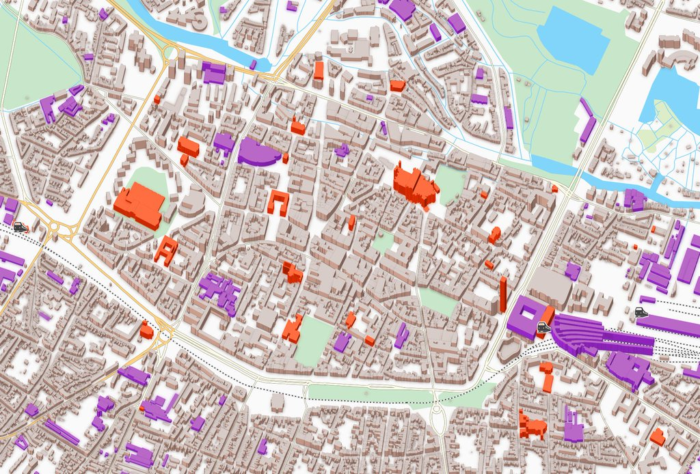

## Comment publier avec QGIS Server ?

* On envoie sur le serveur le projet QGIS et les données liées (ou PostgreSQL )
* On utilise un client WMS comme QGIS pour visualiser les données

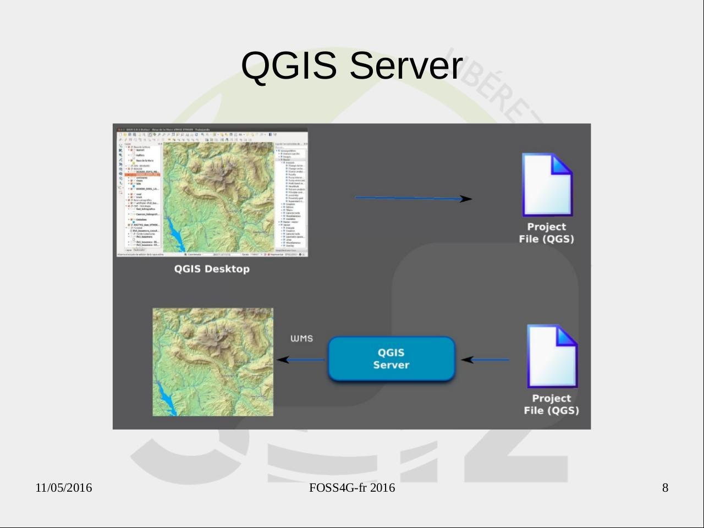

## Qu'apporte Lizmap ?

* Il liste tous les projets publiés sur le serveur
* Il affiche les cartes web pour chaque projet
* Il fait l'intermédiaire entre la carte web et QGIS Server
* Il contrôle les accès aux cartes (gestion des droits)

## Comment publier avec Lizmap ?

* On configure le projet **QGIS** : propriétés du projet, projection, couches
* On configure la carte via le **plugin Lizmap** : échelles, fonds, outils
* On envoie le projet & la configuration sur le serveur
* On visualise sur l'interface de **Lizmap Web Client**

bureau | serveur | browser
--------------------- | --------------------- | ---------------
 | 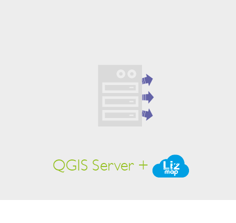 | 

## La page d'accueil des projets

* Les projets sont rangés par répertoire
* Une vignette par projet QGIS: illustration, titre, résumé
* Les projets accessibles en fonction des droits

## La carte Lizmap

* Un bandeau : logo, recherche d'adresse, connexion
* Une barre de navigation
* Un panneau de gauche : couches et légende, métadonnées de la carte
* Une fenêtre à droite pour les outils : impression, localisation
* Une carte miniature avec l'échelle
* Une interface HTML "responsive", adaptée aux différents écrans

## L'environnement de travail pour la Master Class

### Côté Serveur

Pour la Master Class, nous avons installé sur chaque machine un serveur cartographique, basé sur Lizmap. Il contient pour la partie serveur

* **Serveur Web**: Nginx & php-fpm
* **Application cartographique Web**: Lizmap Web Client 3.1beta
* **Serveur cartographique**: QGIS Server 2.14 LTR,
* **Serveur de Gestion de Bases de données**: PostgreSQL 9.6/ PostGIS 2.3
* **Serveur FTP**: Pure-ftpd
* **Serveur de cache**: Redis

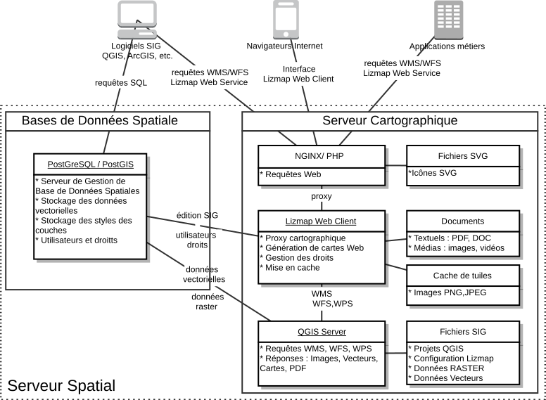

### Côté bureautique

Cette machine est basée sur le système d'exploitation Debian Jessie, et le bureau Xfce. C'est donc aussi un **poste bureautique**, qui contient:

* Une **barre de lancement rapide** d'applications à gauche
  - **Firefox**: navigateur Web, pour visualiser les cartes Lizmap
  - **QGIS**: SIG bureautique, pour créer les cartes
  - **FileZilla**: client FTP, pour envoyer les fichiers sur le serveur
  - **Terminal**: pour administrer la machine
  - **Explorateur de fichiers** pour gérer les dossiers et fichiers

* Une **barre d'état** en bas qui contient les applications ouvertes
* Un menu en bas à gauche pour lancer des applications

## Les données utilisées pour la Master Class

Les données proviennent des portails opendata. Ce sont principalement des fichiers Shapefile. Il sont en projection Lambert 93 (EPSG:2154)

* Des données *Route 500* de l'IGN
* Des données *GéoFLA* de l'IGN
* Nous créerons ensuite des données dans *PostgreSQL*

Les données sont placées dans le répertoire **/home/adminsig/Lizmap/rep1/layers_idf/**

## Le projet QGIS de la Master Class

Nous avons préparé un projet QGIS avec ces données, organisées et mises en forme, afin de faciliter la prise en main.

Lancez QGIS via l'icône de la barre de gauche, puis ouvrir le projet **master_class_lizmap.qgs** situé dans le répertoire **/home/adminsig/Lizmap/rep1/**

## Installation du plugin Lizmap sous QGIS

* Vérifier que le plugin n'est pas déjà installé : menu **Internet > Lizmap**
* Pour l'installer:

    - Menu **Extension > Installer/Gérer les extensions**
    - Dans l'onglet **Tout**, taper dans **Rechercher** le mot "Lizmap", puis sélectionner le plugin et cliquer sur le bouton **Installer**

* Le plugin se trouve dans le menu **Internet > Lizmap** et dans la barre d'outil **Internet** (Vue > Barres d'outil > Site Internet)

## Visualiser la carte Lizmap correspondante au projet QGIS

Lancer le navigateur **Firefox** via la barre de lancement de gauche. Deux onglets sont automatiquement ouverts :

* Un onglet **Projets - Lizmap** avec la page d'accueil de l'application Lizmap (serveur local)
* Un onglet **Lizmap - Documentation** avec la documentation de Lizmap

Dans l'onglet Lizmap, vous pouvez cliquer sur le bouton **Voir la carte** pour le répertoire **Master Class** et le projet **Carte de la région Île-de-France**

## Modifier le projet QGIS

Nous allons modifier quelques propriétés du projet, puis re-publier le projet sur le serveur, pour montrer le fonctionnement de Lizmap.

### Métadonnées du projet QGIS

**Ouvrir les propriétés du projet** : menu *Projet > Propriétés du projet*, onglet **Serveur OWS**.

Case à cocher **Informations générales du service** et modifier le titre, la description, et d'autres informations utiles (métadonnées du projet QGIS)

### Métadonnées des couches

Dans Lizmap, nous utilisons par défaut le titre des couches pour l'affichage (et pas le nom écrit dans la légende QGIS). Pour modifier ces informations:

* Ouvrir les **Propriétés** d'une couche vecteur, en double-cliquant sur son nom dans la légende.
* Onglet **Métadonnées** : vous pouvez par exemple modifier le titre, le résumé de la couche

### Modifier la symbologie d'une couche

Pour tester, nous pouvons changer la couleur des symboles pour la couche **AERODROME**

* Ouvrir les **Propriétés** d'une couche vecteur, en double-cliquant sur son nom dans la légende.
* Dans l'**onglet Style**, choisir une couleur différente pour l'avion, puis valider et fermer.

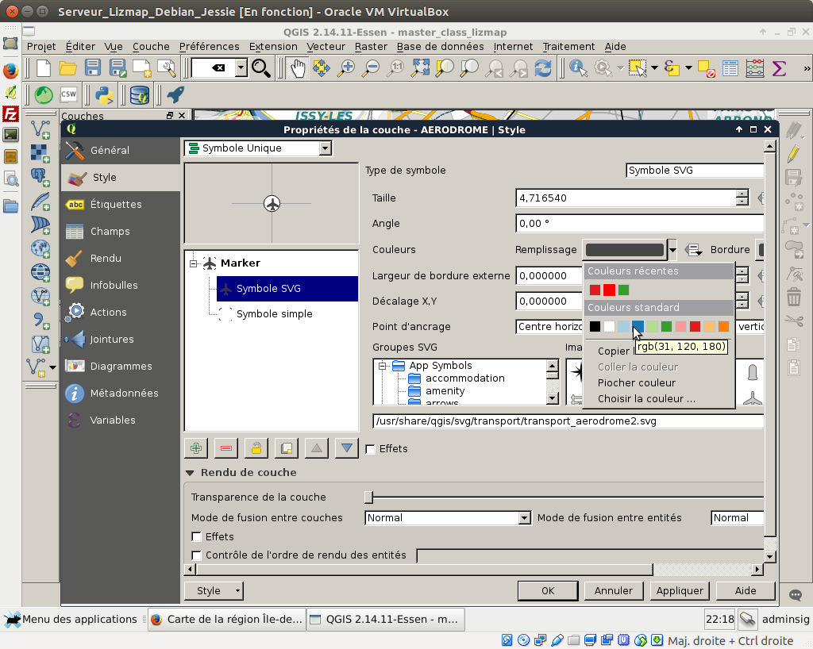

Une fois ces informations modifiées, il faut maintenant:

* **enregistrer le projet QGIS**
* **enregistrer la configuration Lizmap** via le plugin, puis
* **publier le projet et la configuration** sur le serveur

## Préparer la publication avec le plugin Lizmap

**Ouvrir le plugin Lizmap**: une boite de dialogue apparaît avec 6 onglets.

* **Couches** : la configuration détaillée couche par couche (titre, description, lien, cache, format d'image, etc.)
* **Carte** : choix des outils simples (impression, recherche d'adresse, etc.), des échelles, de l'emprise initiale de la carte,
* **Fonds** : choix des fonds externes (OpenStreetMap, Géoportail IGN, etc.) et des fonds Lizmap
* **Outils** : activation ou désactivation des outils avancés (localiser par couche, édition, filtrage, table attributaire)
* *FTP* : outil de synchronisation basé sur le FTP. **désactivé**
* *Log* : Fenêtre contenant les messages liés à la configuration

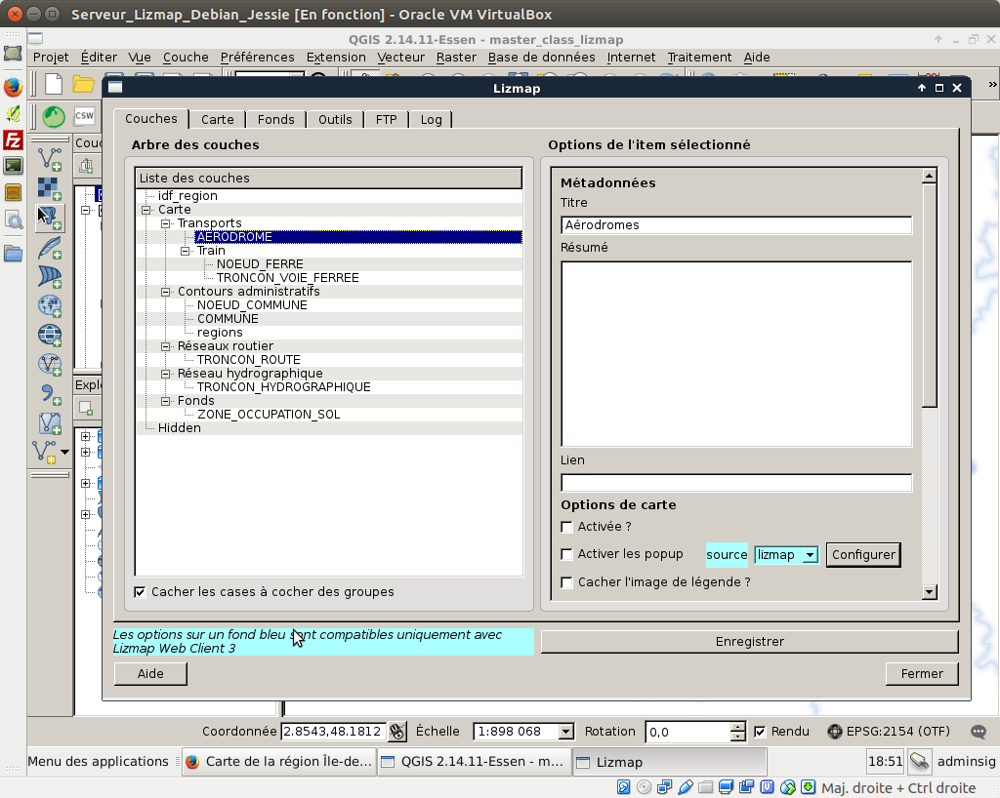

Pour enregistrer la configuration Lizmap, il suffit d'appuyer sur le bouton **Enregistrer**

* Cela enregistre un fichier **.qgs.cfg** au même niveau que le projet QGIS

Une fois ce fichier enregistré, nous devons envoyer sur le serveur **le projet QGIS modifié**, ainsi que **la configuration Lizmap** mise à jour.

Pour cela, nous utilisons aujourd'hui le protocole FTP.

## Envoyer son projet et les données via FTP

Normalement, les fichiers doivent être **poussés sur le serveur distant**. Nous pouvons utiliser le **FTP** (sécurisé via SSL).

*NB: Dans notre cas, le serveur est notre machine. Nous allons quand même montrer comment transférer les données via FTP.*

* On utilise un **client FTP**, par exemple **FileZilla**: le lancer via la barre de gauche
* Ouvrir le **gestionnaire de connexion** via le 1er bouton de la barre d'outils
* Une connexion **Liz.map** doit normalement être configurée. Le mot de passe est *12345678* pour l'utilisateur *lizmap*
* Se connecter via le **bouton Connexion**
* Le panneau de gauche liste **les fichiers locaux** du répertoire **/home/adminsig/Lizmap/**: aller sur le répertoire **rep1**  dans lequel se trouve votre projet QGIS
* Le panneau de droite liste **les répertoires du serveur distant** : *commun*, *rep1*

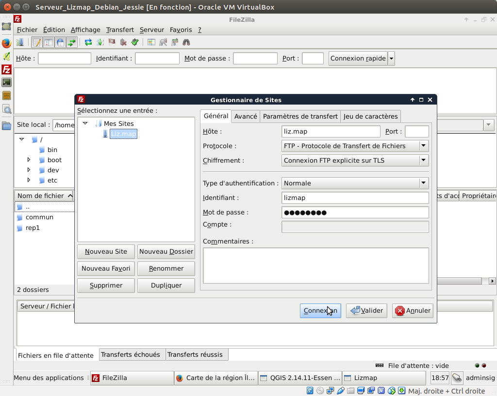

La navigation est synchronisée entre le panneau de gauche et de droite. Le projet, la configuration ainsi que les fichiers sont présents en local, et sur le serveur.

* Envoyer les fichiers du **projet QGIS** (.qgs) et le fichier de **configuration Lizmap** (.qgs.cfg) du répertoire local **rep1/** vers le répertoire distant **rep1**

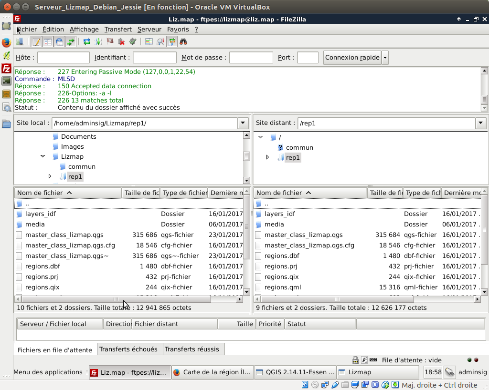

* **Vérifier les modifications sur la carte en Ligne**: rafraîchir la page web de la carte Lizmap dans le navigateur.

**--> Vous devez voir les modifications effectuées sur votre projet QGIS**: titre du projet, métadonnées des couches, styles des aéroports.

## L'onglet Couches du plugin Lizmap

Nous allons voir quelques options de cet onglet

* les **métadonnées** : titre, résumé, et lien
* la **popup**: fenêtre d'information sur les objets
* **groupe comme une couche**

### Les métadonnées

* Le plugin reprend les métadonnées renseignées via les propriétés de la couche.
* On peut éditer le titre et le résumé depuis cette interface.
* On peut ajouter un lien, de type **URL** (ex: http://3liz.com ) ou **un document** posé dans le répertoire **media/**

* **Enregistrer le projet QGIS, la configuration Lizmap, et re-publier via FTP pour tester**

### Les Popups: des informations sur clic de la carte

Une popup est une **fenêtre d'information** qui est affichée à l'utilisateur lorsqu'il clique sur la carte. Elle contient les données attributaires des couches vectorielles pour lesquelles les popups sont activées.

* Ouvrir le plugin Lizmap, **onglet Couches**
* Pour les couches suivantes, cocher la case **Activer les popups**

    - **Aérodromes**
    - **Gares**
    - **Communes**

* **Enregistrer et publier pour tester**

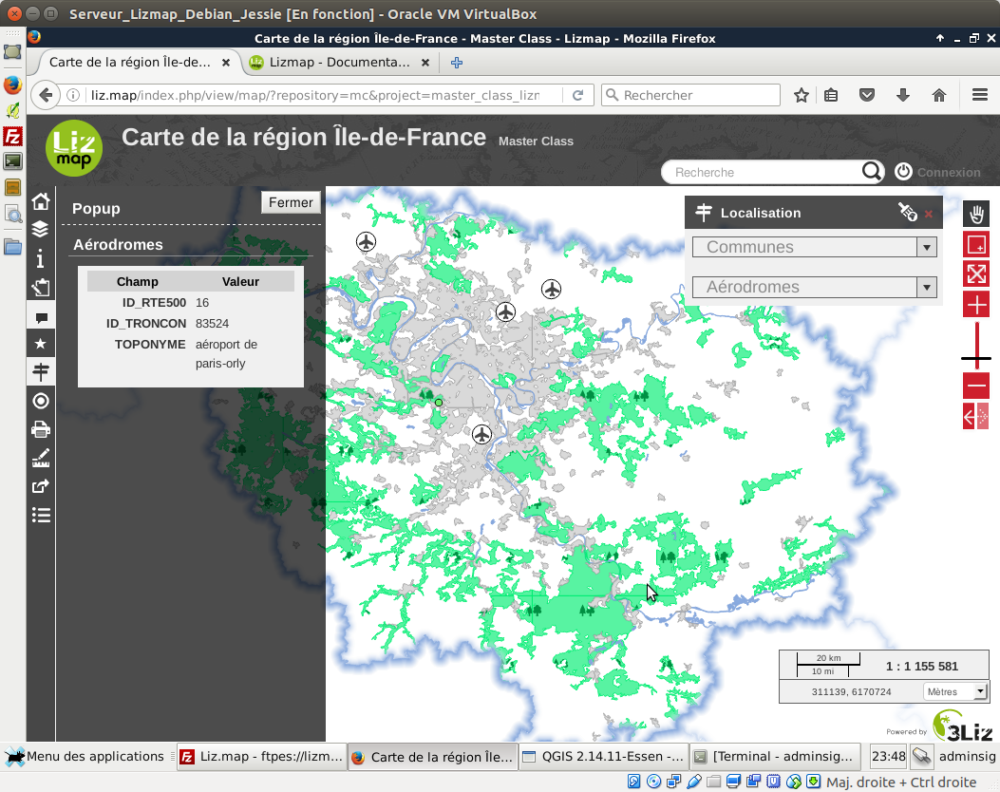

Il est possible:

* **de limiter les colonnes affichées** dans la popup via la **colonne WMS du tableau de l'onglet Champs** des propriétés de chaque couche vectorielle
* **d'utiliser des alias** à la place du nom des champs pour l'affichage : **colonne Alias du tableau des champs**
* **d'afficher des images et des liens** dans les popups: nous le verrons plus tard.

## L'onglet Carte du plugin Lizmap

Dans le plugin Lizmap, **onglet Carte**, il est possible d'ajouter les outils suivants via le groupe **Outils de la carte**

 - **Impression** : il faut avoir au moins un composeur QGIS -> nous le verrons ensuite
 - **Outils de mesure** : ajoute un menu pour mesure une longueur, une aire ou un périmètre
 - **Zoom précédent/suivant** : ajoute 2 boutons pour naviguer entre les emprises déjà visitées
 - **Positionnement automatique** : demande au navigateur la position via api ou GPS et recentre la carte
 - **Recherche d'adresse** : permet de chercher une adresse et de zoomer sur le résultat sélectionné

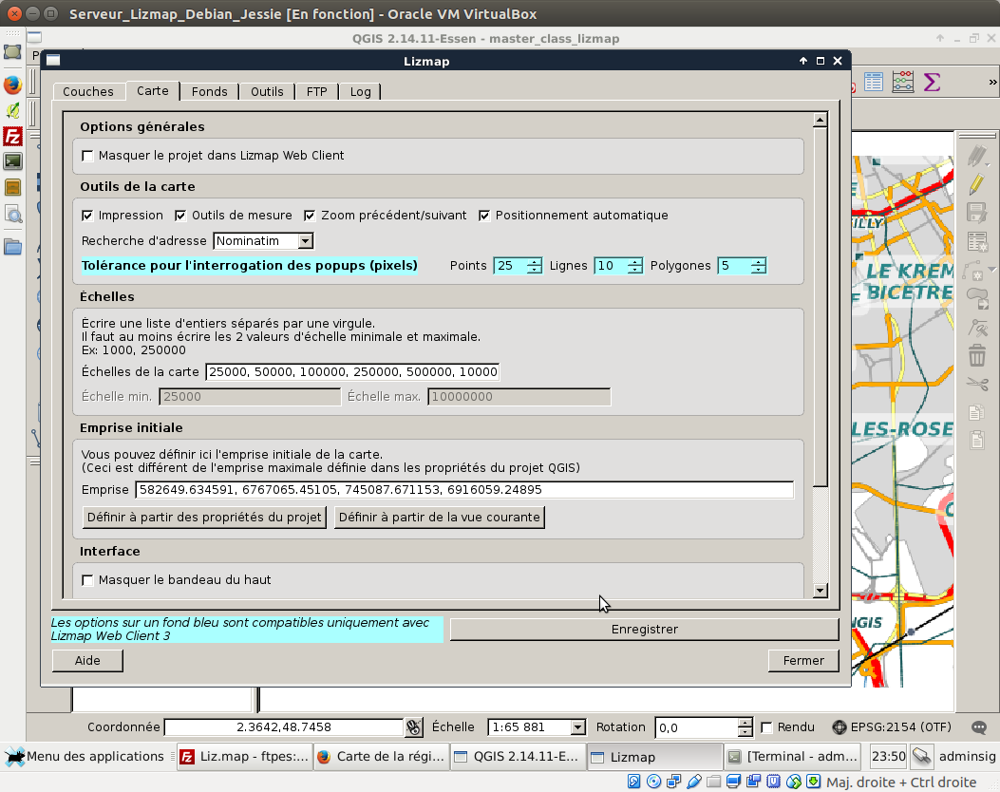

## L'onglet Outils du plugin Lizmap

Cet onglet permet de configurer les outils avancés de Lizmap.

### Zoomer facilement sur une zone : Localiser par couche

On souhaite proposer à l'utilisateur des listes déroulantes où il pourra choisir un lieu sur lequel zoomer. La carte présente déjà un exemple sur les communes.

* Tester dans le navigateur la liste des communes :

  - une **liste déroulante apparaît en haut à droite** avec la liste des communes dans l'outil **Localisation** au dessus de la légende.
  - la **sélection d'un item** zoome la carte sur la géométrie correspondante
  - On peut **taper les premières lettres** d'une commune et utiliser l'autocomplétion puis la touche Entrée.

Pour ajouter une couche:

* Ouvrir le menu **Projet > Propriétés du projet > Onglet Serveur OWS**.
* Dans le groupe **Capacités WFS**, cocher **Publier** pour la couche **AERODROME**
* Ouvrir le plugin Lizmap, **Onglet Outils**
* Dans le groupe **Localiser par couche** choisir la couche **AERODROME** et l'attribut **TOPONYME** à afficher et cocher **Afficher la géométrie**. Puis bouton **Ajouter la couche**

### L'affichage de tableaux de données

Nous souhaitons proposer à l'utilisateur un affichage des données sous la forme de tableaux. Pour cela, il suffit

* de publier la/les couches **en WFS** via les propriétés du projet QGIS (onglet Serveur OWS)
* d'utiliser l'outil **Table attributaire** de l'onglet **Outils** du plugin Lizmap
* On choisit la couche, l'**identifiant unique** (privilégier les entiers et clés primaires) et on l'ajoute via le bouton.

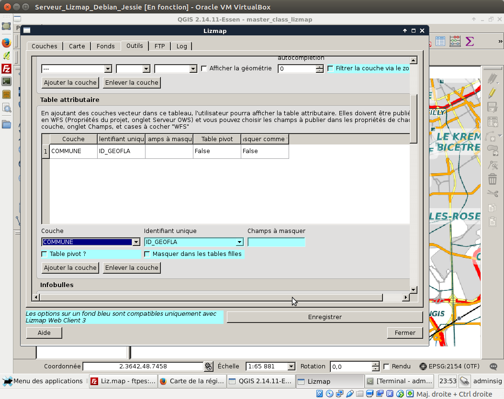

On enregistre, et on publie sur le serveur. 
L'activation de la table attributaire pour une couche entraîne l'ajout de fonctionnalités:

* affichage du **tableau des données**
* **export** des données vectorielles
* **sélection** des données
* **filtre** des données

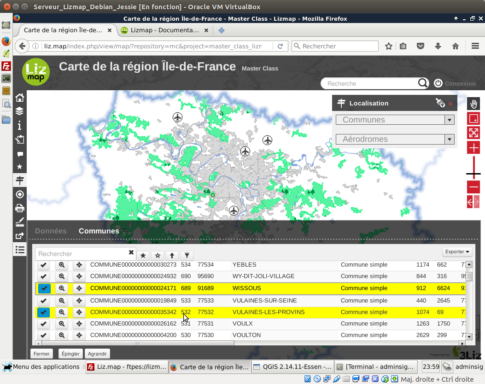

## L'édition de données dans Lizmap

### Préparer l'édition de données

Nous souhaitons permettre aux utilisateurs de **modifier certaines couches** publiées dans la carte. Pour cela, nous devons utiliser des couches stockées dans une base **PostGreSQL/PostGIS**

* Ouvrir QGIS et lancer le **gestionnaire de base de données**: Menu Base de données > Gestionnaire de bases de données
* Dans l'arbre de gauche, double-cliquer sur **PostGIS > Lizmap > public**
* Créer un couche via le menu **Table > Créer une table**
* Donner un **Nom** : **eolienne** -> pas d'accent ou espaces !!!
* Ajouter les champs suivants:

    - id / serial
    - nom / text
    - categorie / text
    - hauteur / integer
    - description / text (cocher la case NULL)
    - photo / text (cocher la case NULL)

* **Clé primaire** : id
* Cocher **Créer une colonne géométrique** de type **POINT** / geom / Dimension 2 / SRID **2154**
* Cocher **Créer un index spatial**
* Valider avec le bouton **Créer**

### Configurer l'édition de données dans QGIS

* On ajoute la couche **eolienne** dans le projet QGIS
* On ouvre les propriétés de la couche, onglet **Champs**
* On choisit des types de champs via le bouton **Outil d'édition**

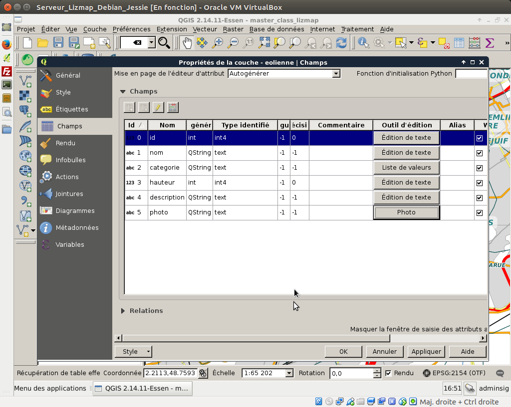

On peut tester dans QGIS en ouvrant la table attributaire

* Sélectionner la couche dans la légende
* Menu Vue > Barres d'outils > **Barre d'outils de la numérisation**
* Cliquer sur le bouton **Crayon** pour basculer en mode édition
* Dans la barre de numérisation, cliquer sur **Ajouter une entité** ( 3 points )
* Dans le formulaire, renseigner les différents champs
* Valider, puis **enregistrer** via la disquette dans la barre de numérisation

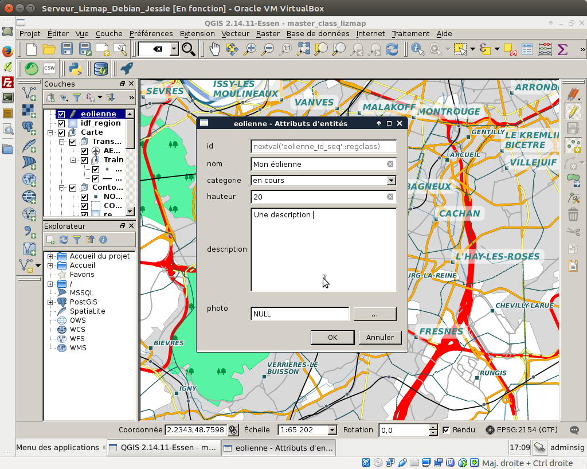

### Configurer l'édition de données dans Lizmap

* On ouvre les propriétés du projet QGIS (Menu Projet > Propriété du projet), on **publie en WFS** (case à cocher dans Capacités WFS ) -> Valider
* On lance le plugin Lizmmap, onglet Outils, groupe **Edition de couches**
* On choisir la couche eolienne, on coche toutes les cases (Créer, Modifier les attributs, Modifier la géométrie, Supprimer), on ajoute.
* On enregistre la configuration Lizmap via **Enregistrer**.

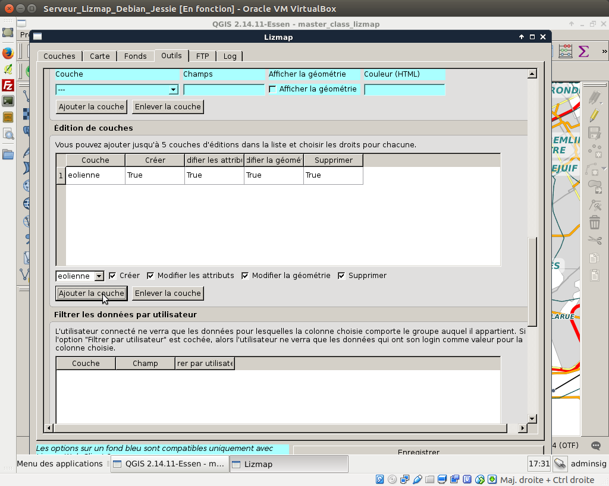

* On **publie** le projet QGIS et la configuration via FTP, et on teste dans le navigateur.

## Les relations entre couches

On peut gérer les **relations parent/enfants** entre sources de données dans QGIS, et donc dans Lizmap. 

Nous allons l'illustrer avec **des travaux sur les éoliennes**

### Créer une table travaux

* Ouvrir le **gestionnaire de bases de données** (menu Bases de données )
* Se connecter via l'arbre de gauche à **Postgis > Lizmap > public**
* Menu **Table > Créer une table** -> l'appeler **travaux**
* Ajouter les **champs** suivants:

    - id / serial
    - id_eolienne / integer
    - date / date
    - auteur / text
    - description / text
 * **clé primaire** = id
 * **Enregistrer**

* Ajouter la couche dans QGIS

### Configurer la relation éoliennes / travaux

On va maintenant déclarer la relation entre les éoliennes et les travaux. Dans les **propriétés du projet** ( CTRL + MAJ +P ), onglet **Relations**

Ajouter une nouvelle relations, avec les paramètres suivants:

### Configurer les outils d'édition pour la couche travaux

On ouvre les **propriétés de la couche**, et dans l'onglet **Champs**, on choisit l'outil d'édition adapté. 

* **Calendrier** pour le champ date.
* **Valeur relationnelle** pour le champ **id_eolienne** -> on va choisir de remplir une liste déroulante avec le nom des éoliennes

On teste l'ajout d'un travail dans QGIS avec le formulaire.

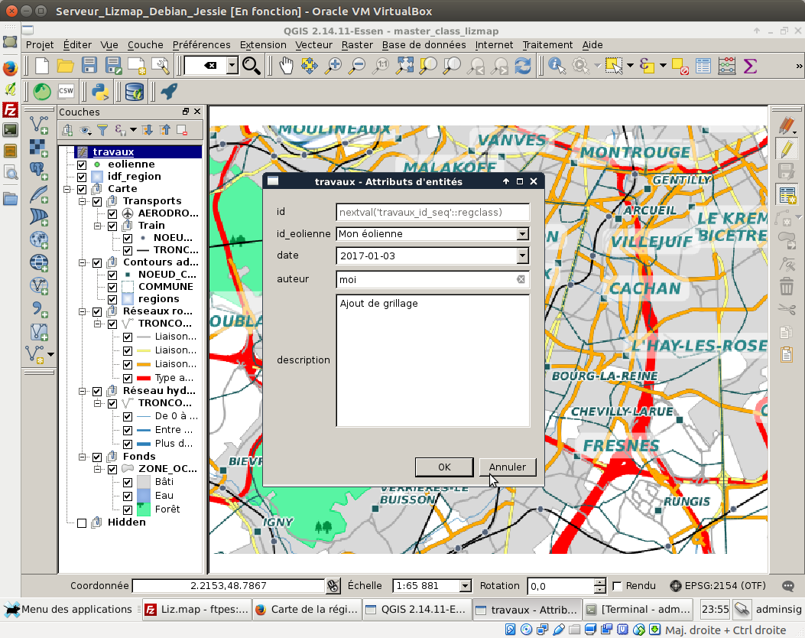

Quand on ouvre la **table attributaire des éoliennes** on peut maintenant consulter les travaux fils.

### Publier la table attributaire dans Lizmap

* Publier les éoliennes et les travaux en **WFS** -> **Propriétés du projet** QGIS
* Dans le **plugin Lizmap**, onglet **Outils**, ajouter les couches **eolienne** et **travaux** dans la table attributaire, en précisant **id** pour l'identifiant unique.
* Dans le tableau des couches d'**édition**, ajouter aussi la couche **travaux**

Enregistrer la configuration Lizmap, et tester:

* Outil d'édition : on peut ajouter un travail et préciser l'éolienne via la liste déroulante.

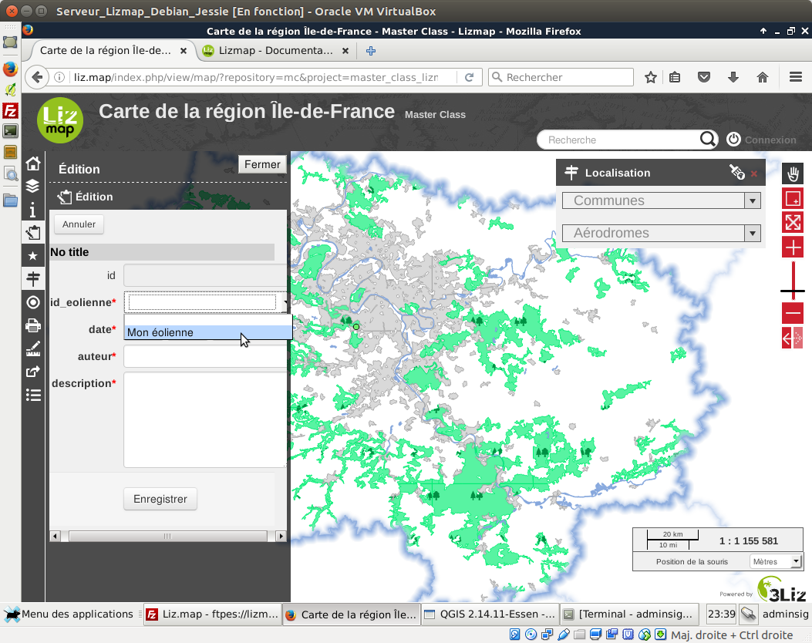

* Dans la table attributaire, si on affiche les éoliennes, on a un tableau des travaux fils en dessous

## L'impression dans Lizmap

Pour pouvoir proposer une impression de la carte dans Lizmap, il suffit de créer un ou plusieurs composition QGIS

* Ouvrir le menu **Projet > Nouveau composeur d'impression**. Donner un nom.
* **Ajouter une carte, un titre et une légende**
* **Sauvegarder le projet QGIS** et fermer le composeur
* Ouvrir le plugin Lizmap, **Onglet Carte**
* Vérifier que la case **Impression simple** est cochée
* Publier, rafraîchir et tester l'impression

## Ajouter une carte miniature

* On souhaite présenter une **carte miniature** qui montre dans quelle zone l'utilisateur se trouve lorsqu'il navigue sur la carte
* Ajouter un groupe **Overview** (bien écrire avec une majuscule) à la racine de la légende de QGIS
* **Y ajouter une couche**, par exemple la couche **Quartiers**
* **Enregistrer le projet QGIS et publier, puis tester**

## Masquer des couches sur le projet Web

Certains couches doivent rester présentes dans le projet, mais on ne souhaite pas que l'utilisateur les voit une fois publiées

* Ajouter un groupe **hidden**
* **Y déplacer les couches qu'on souhaite masquer**
* **Publier et tester**

## Regrouper des couches

* Dans le plugin Lizmap , **onglet Couches**
* Choisir un groupe, par exemple le groupe **Transport** et le sélectionner.
* Cocher l'option **Groupe comme une couche**
* Enregistrer la configuration, **publier via le FTP** --> Tester le résultat sur la carte Web.

On peut aussi utiliser l'option **Fond de carte** pour un groupe. Les couches sont alors regroupées, et ce groupe apparaît dans la liste déroulante des fonds.

## Autres fonctions avancées

* **La protection des répertoires de cartes** par utilisateur et groupes
* **Les popups au format HTML** : ajouter du contenu riche pour décrire les objets dans Lizmap
* La création automatique du **cache de tuiles côté serveur**

## Les ressources

**Documentation** : http://docs.3liz.com/fr/

**Code source**

* Lizmap Web Client : https://github.com/3liz/lizmap-web-client
* Lizmap Plugin : https://github.com/3liz/lizmap-plugin

**Site internet** : http://3liz.com

## Roadmap

* Lancement de traitements complexes côté serveur et affichage des résultats (WPS et module Traitement)
* Intégration d'OpenLayers 3
* Lizmap Mobile en mode déconnecté
* etc.

## Les services de 3liz autour de Lizmap

* **Formation**
* **Hébergement complet**: Lizmap Hosting
* **Développement de fonctionnalités** génériques ou métiers
* **Conseils**, optimisation d'une instance
* Ajout de fonctionnalités pour **QGIS Server**
* **Installation** sur serveur Linux

